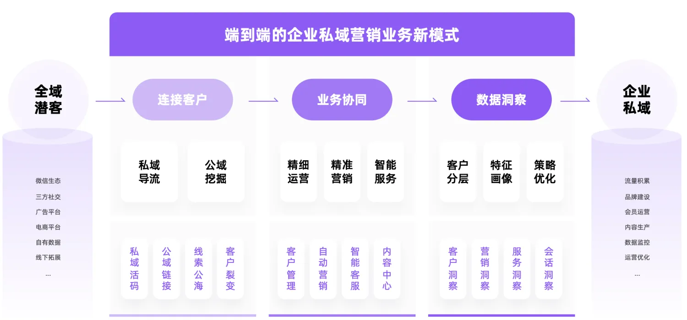
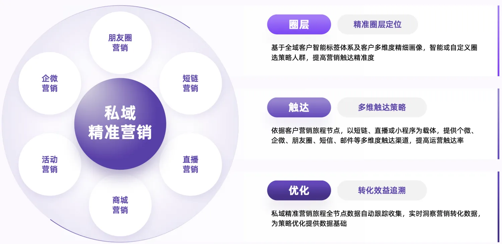
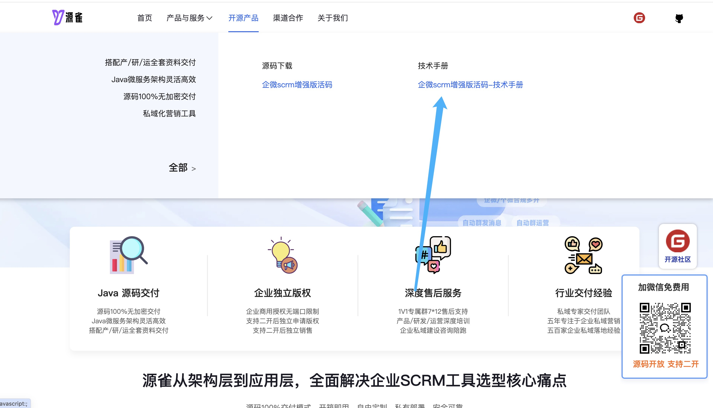
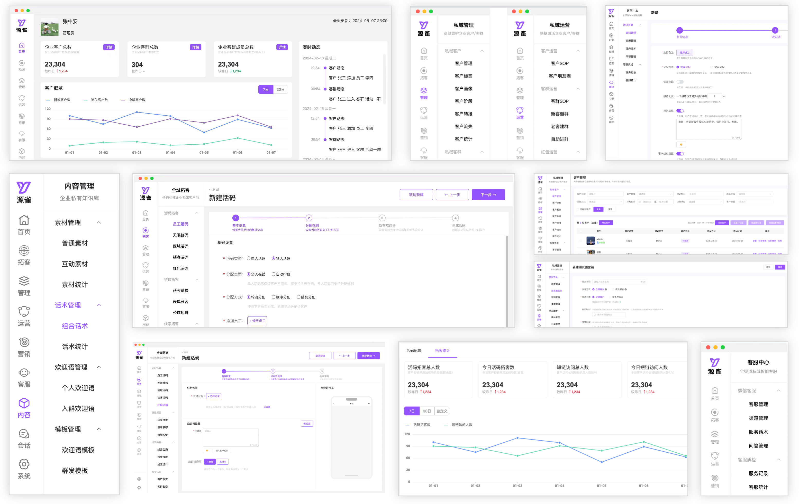
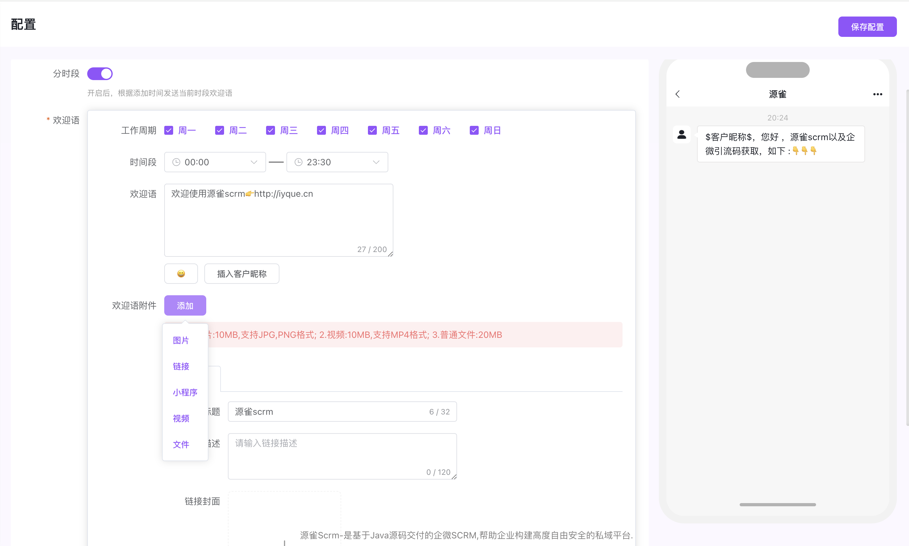
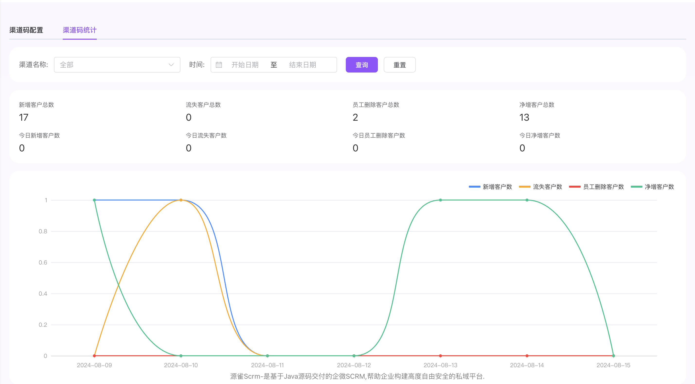

## 一、背景

在过去企业大部分采用SaaS模式的SCRM标准化产品，能满足一定的需求，云部署的模式也能节省企业的成本。尽管目前市场SCRM工具众多，但企业私域建设工具选型仍存在如下核心痛点：

- 市场混乱，产品同质性问题显著
- SaaS模式与业务脱节，缺乏灵活定制能力
- 系统兼容性问题复杂，未来拓展性有限
- 数据安全、隐私保护及合规方面存在隐患

所以随着企业私域建设的深入以及业务的差异化竞争，除了需要基本SCRM标准能力外，灵活的二开定制能力、数据隐私及安全机制以及私有化部署模式是企业在工具选型时评估的重要指标。

## 二、介绍

源雀SCRM是 **源码100%开放** 的私域数智化营销解决方案，基于私域运营闭环，打通 **“运营、营销、服务三位一体化”** 链路，搭建从全域潜客端到企业私域端的企业私域营销业务新模式，实现企业私域的高效运营及持续增长。

同时通过源码100%开放的交付策略，从架构层到应用层再到服务层，全面解决企业私域数据安全及业务定制化问题，实现SCRM  **“开箱即用、自由定制、私有部署、持续服务”** 的建设目标。



## 三、架构

源雀SCRM基于 **“拓客->管理->运营->营销->服务->分析”** 全链路，完成一站式私域数智化营销，具体如下：

- **拓客链路：** 
  - 全域拓客：全域四大场景规模拓客，低成本快速沉淀私域客户池；
- **管理链路：** 
  - 私域管理：基于客户/客群全维度画像，实现一站式精细管理；
- **运营链路：** 
  - 私域运营：基于精细画像，建立自动化运营策略，个性化运营；
- **营销链路：** 
  - 私域营销：构建策略人群，全旅程自动精准营销；
- **服务链路：** 
  - 客服中心：全渠道微信智能客服，灵活分配，高效服务；
  - 内容中心：全类型企业内容生产，全场景触达智能跟踪；
  - 会话存档：聊天数据实时存储，沟通风险实时监控，实现数据安全合规；
  - 数字员工：全局AI解放生产力，让企业私域运营充满无限可能；
- **分析链路：** 
  - 数据洞察：私域全链路数据分析，优化营销策略，驱动业务增长；



## 四、优势

基于源码100%开放的源雀SCRM，从源头解决了企业私域建设核心痛点，实现高自由度、高私有化及高安全性，同时为企业私域建设带来四大优势：

- 系统高度可用，部署灵活高效
- 研发降本增效，满足定制需求
- 数据安全可控，自主知识产权
- 降低云服务依赖与供应商绑定


## 五、开源

### 5.1 介绍

源雀SCRM基于源码100%开放的策略，积极拥抱开源，目前已推出了一个完全开源、免费使用的源雀SCRM开源版，让企业快速拥有更强大、更丰富、更智能的企业微信管理能力。

目前源雀SCRM开源版已开源基础引流能力，具体如下：
 #### 员工智能活码:
- 自动打标签：客户通过定义的活码添加好友会，会自动为客户打上相关的标签；
- 免验证添加：客户扫码添加员工好友,无需员工确认，自动同意；
- 重复添加：同一客户扫码，只可添加到指定员工，避免客户添加多个员工；
- 多样化欢迎语：可为每个员工定义不同的欢迎语模版；
- 活码logo自定义：二维码logo可自行定义；
- 自动备注：按照添加时间，标签，渠道名为客户添加自动备注；
- 渠道统计：按照时间或渠道维度，统计客户增加流失等情况；
 #### 获客外链:
- 通过外部短链自动拉起微信。
- 自动打标签：客户通过定义的活码添加好友会，会自动为客户打上相关的标签；
- 免验证添加：客户扫码添加员工好友,无需员工确认，自动同意；
- 重复添加：同一客户扫码，只可添加到指定员工，避免客户添加多个员工；
- 多样化欢迎语：可为每个员工定义不同的欢迎语模版；
- 自动备注：按照添加时间，标签，渠道名为客户添加自动备注；
- 渠道统计：按照时间或渠道维度，统计客户增加流失等情况；

注: 目前开源版功能只涉及活码相关功能,后续会不断迭代企微常用的相关功能。

### 5.2 架构

后端：采用springboot+jpa+h2架构，项目内置h2数据库，开箱即可使用；

前端：采用vue3+vite+pinia+element-plus；

### 5.3 安装

1. 后端配置文件修改

```
application.yml

 iyque:
    userName: iyque #系统登录账号
    pwd: 123456 # 系统登录密码
    demo: true #设置为false后系统不可进行修改操作
    fileViewUrl: https://iyque.cn/qapi/file/fileView/ #即后端api路径
    uploadDir: ./upload #文件本地存储路径

#系统内置了H2数据库,无需安装单独的数据库,username与password可以使用默认的也可自定义
#数据库控制台默认访问地址: {系统访问前缀}/h2
datasource:
   url: jdbc:h2:file:./data/mydb;
   username: iyque
   password: 123456
```

2. 后端应用打包与启动

```
打包: mvn clean package
启动: nohup java -jar xxx.jar > iyque.log 2>&1 &
```

3. Nginx部署

```
 后端api代理设置:
 location ^~/oApi/ {
        proxy_pass http://127.0.0.1:8086/;
    }
 
 前端应用部署设置:
   location /tools {
        root /usr/local/nginx/html/prod;
        index index.html index.htm;
        try_files $uri $uri/ /tools/index.html;
        proxy_read_timeout 150;

        # 处理跨域
        add_header Access-Control-Allow-Origin '*' always;
        # add_header Access-Control-Allow-Headers '*';
        add_header Access-Control-Allow-Methods '*';
        # add_header Access-Control-Allow-Credentials 'true';
        if ($request_method = 'OPTIONS') {
            return 204;
        }
    }
```

4. 前端部署

在 `sys.config.ts` 中配置开发、生产等各个环境的：接口域名、路由基础路径，页面基础路径等：

```
// 环境变量
const envs = {
  development: {
    DOMAIN: 'https://iyque.cn', // 站点域名，会根据此处域名判断应用环境
    BASE_URL: '/tools/', // 页面路由基础路径 /*/*/，eg：/a/
    BASE_API: 'https://iyque.cn', // 后端api接口地址
  },
  production: {
    DOMAIN: 'https://iyque.cn',
    BASE_URL: '/tools/',
    BASE_API: 'https://iyque.cn',
  },
}

let mode =
  process.env.NODE_ENV == 'development' || !globalThis.document
    ? process.env.VUE_APP_ENV
    : Object.keys(envs).find((e) => envs[e].DOMAIN === window?.location.origin)

export const env = { ...envs[mode], ENV: mode }

// 系统常量配置
export const common = {
  SYSTEM_NAME: '源雀', // 系统简称
  SYSTEM_SLOGAN:
    '<a href="https://www.iyque.cn?utm_source=iyquecode" target="_blank">源雀SCRM -基于SpringCloud+Vue架构,100%开放源码的企微私域营销系统</a> ', // 系统标语
  COPYRIGHT: 'Copyright © 2024 源雀 All Rights Reserved.', // 版权信息
  LOGO: env.BASE_URL + 'static/logo.png', // 深色logo
  COOKIEEXPIRES: 0.5, // token在Cookie中存储的天数，默认0.5天
}
```

5. 启动

Node推荐16.x及以上版本。

```
# 进入项目目录
cd you-project-name

# 安装依赖
npm i
# 或者使用cnpm
npm install -g cnpm --registry=https://registry.npmmirror.com
cnpm i

# 启动开发服务
npm run dev

# 构建生产环境
npm run build
```
### 5.4 配置文档
地址:https://www.iyque.cn/


### 5.5 计划

源雀SCRM开源版会根据产品实际情况，积极开放更多能力。目前初步开源计划如下：

- 2024.Q3：开源源雀SCRM增强引流及场景化能力；
- 2024.Q4：开源企业微信客户/客群基础管理能力；
- 2025.Q1：开源源雀SCRM客户/客群运营能力；
- 2025.Q2：开源源雀SCRM群发场景化能力；
- 更多计划正在积极筹备中...
## 六、页面展示





## 七、联系

如有包括但不限于以下需求，可随时通过源雀官方企微联系我们：

- 开源项目技术答疑
- 获取源雀SCRM完整体验系统；
- 源雀SCRM商务合作；
- 源雀SCRM产品交流；
- 更多咨询或服务...


